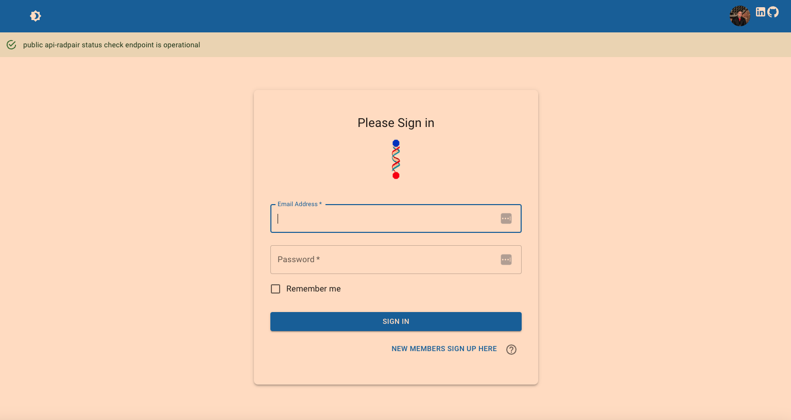
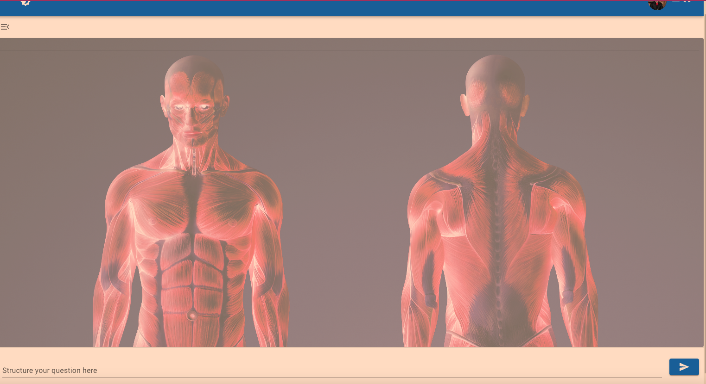
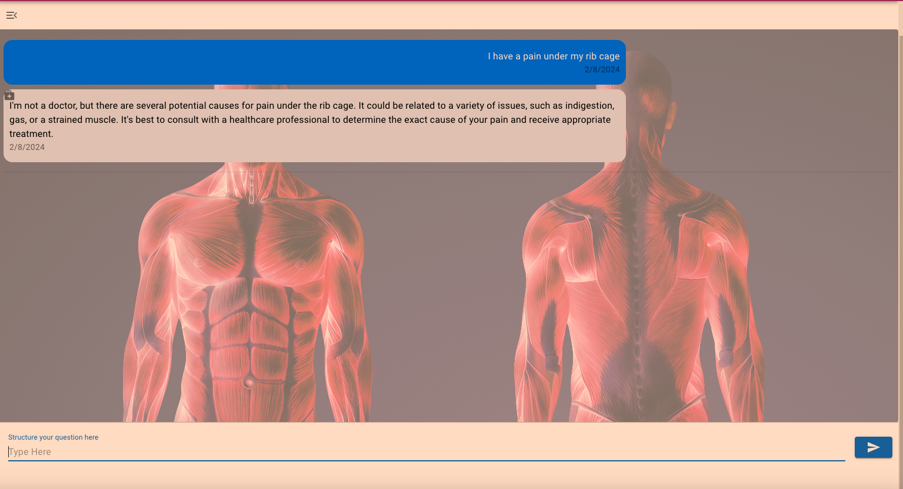
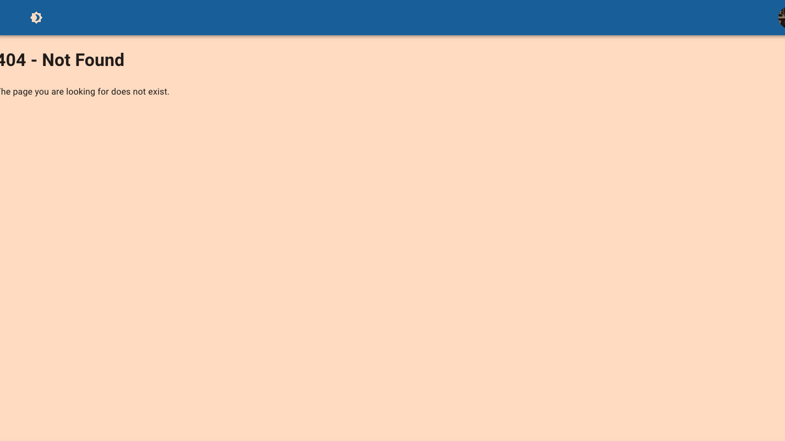

# Running the FRONTEND application

## backend app can be found here: https://github.com/TravJav/rad-backend

## ATT as a precondition to running the app properly you need to have Docker installed on your local machine and running this is required because the backend application in the backend-app directory is a precondition to run the app and query chatgpt, there will be another README in the directory for the backend

[Start here or proceed to run without a server](./backend-app/README.md)

1. npm i within the project directory or the same level as this README
2. after the node packages have been installed run npm start
3. default port should be 3000, if you have something else running on this port you will get a prompt to run on the next available port starting from 3001 and up
4. navigate to your browser and you should be presented with the "Please Login View" you can bypass the sign in by naviagting to the /dashboard directory manually

# Application shots

ATT: all assets in the asset folder are legal resources for me to use like the logo which I built with a software service as well as the body_map image which I purchased on Shuttershock.

## Login Page

I created the login page because to access a service like this you would need to login first before using any functionality, I could have just created a single component but it wouldn't have felt right to me so I took a more hollistic assumption and kind of treated this as a full stack application to make it more realistic but give a better in depth indiciation of what would be involved in an application like this if we were actually deploying this.

## Dashboard

The Dashboard was created as the primary view you I added a unique image that I bought from Shuttershock to highlight the unique domain in this case which is Radiology. The image below is pre-query of the backend call we make.

## Dashboard After Query

Again we have the Dashboard view but this time we see a few different things and that is we see the query has taken place and we have a chat gpt response now! I borrowed the normalized chat bubbles we're all use to along with a small icon that indicates there is some kind of medical assistant who replied.

## Not Found

I added the 404 page here to highlight realism in the sense that how would we handle a user navigating to the wrong route? well with this ofcourse!

